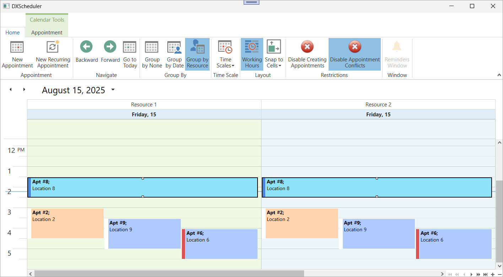

<!-- default badges list -->

[](https://supportcenter.devexpress.com/ticket/details/T565891)
[](https://docs.devexpress.com/GeneralInformation/403183)
[](#does-this-example-address-your-development-requirementsobjectives)
<!-- default badges end -->

# WPF Scheduler - Apply User Restrictions

This example applies the following user restrictions:

* Prevents users from creating new appointments.
* Prevents users from moving appointments into the lunch break interval (12:00–13:00).

In this example, the Ribbon UI displays the **Disable Creating Appointments** and **Disable Appointment Conflict** controls that [toggles these restrictions](#toggle-restrictions).



## Implementation Details

### Define Restricted Interval

The restricted interval covers the lunch break time (12:00–13:00):

```csharp
TimeInterval lunchTime = new TimeInterval(DateTime.Today.AddHours(12), TimeSpan.FromHours(1));
```

The `IsIntervalAllowed` method returns `false` if any part of the selected interval overlaps with the restricted time range:

```csharp
private bool IsIntervalAllowed(TimeInterval interval) {
    DateTime dayStart = interval.Start.Date;
    while (dayStart < interval.End) {
        if (interval.IntersectsWithExcludingBounds(lunchTime))
            return false;
        dayStart = dayStart.AddDays(1);
    }
    return true;
}
```

### Prevent Appointment Creation

The [`CustomAllowAppointmentCreate`](https://docs.devexpress.com/WPF/DevExpress.Xpf.Scheduling.SchedulerControl.CustomAllowAppointmentCreate) event blocks new appointment creation if the selected interval intersects with the lunch break time:

```csharp
private void schedulerControl1_CustomAllowAppointmentCreate(object sender, AppointmentItemOperationEventArgs e) {
    var selectedInterval = new TimeInterval(schedulerControl1.SelectedInterval.Start, schedulerControl1.SelectedInterval.End);
    e.Allow = IsIntervalAllowed(selectedInterval);
}
```

Disable the [`AllowAppointmentCreate`](https://docs.devexpress.com/WPF/DevExpress.Xpf.Scheduling.SchedulerControl.AllowAppointmentCreate) property to turn off the default logic for creating appointments. The event handler applies custom rules for appointment creation in restricted time ranges.

```xaml
<dxsch:SchedulerControl
    Name="schedulerControl1"
    AllowAppointmentCreate="False"
    CustomAllowAppointmentCreate="schedulerControl1_CustomAllowAppointmentCreate"
    ... />
```

### Prevent Appointment Conflicts

The [CustomAllowAppointmentConflicts](https://docs.devexpress.com/WPF/DevExpress.Xpf.Scheduling.SchedulerControl.CustomAllowAppointmentConflicts) event prevents dragging appointments into the lunch break time range:

```csharp
private void schedulerControl1_CustomAllowAppointmentConflicts(object sender, AppointmentItemConflictEventArgs e) {
    if (!IsIntervalAllowed(e.Interval))
        e.Conflicts.Add(e.AppointmentClone);
}
```

Set the [`AllowAppointmentConflicts`](https://docs.devexpress.com/WPF/DevExpress.Xpf.Scheduling.SchedulerControl.AllowAppointmentConflicts) property to `false` to disable sharing the schedule time between two or more appointments. Apply the handler that implements the custom logic:

```xaml
<dxsch:SchedulerControl
    Name="schedulerControl1"
    AllowAppointmentConflicts="False"
    CustomAllowAppointmentConflicts="schedulerControl1_CustomAllowAppointmentConflicts"
    ... />
```

### Toggle Restrictions

Users can toggle restrictions through **Disable Creating Appointments** and **Disable Appointment Conflict** ribbon controls:  

```xaml
<dxr:RibbonPageGroup Caption="Restrictions">
    <dxb:BarCheckItem 
        Content="Disable Creating Appointments" 
        CheckedChanged="BarButtonItem_ItemClick" 
        .../>
    <dxb:BarCheckItem 
        Content="Disable Appointment Conflicts" 
        CheckedChanged="barCheckItem2_CheckedChanged" 
        .../>
</dxr:RibbonPageGroup>
```

Each control enables or disables the related event handler:

```csharp
private void BarButtonItem_ItemClick(object sender, DevExpress.Xpf.Bars.ItemClickEventArgs e) {
    if (barCheckItem1.IsChecked == true)
        schedulerControl1.CustomAllowAppointmentCreate -= schedulerControl1_CustomAllowAppointmentCreate;
    else
        schedulerControl1.CustomAllowAppointmentCreate += schedulerControl1_CustomAllowAppointmentCreate;
}

private void barCheckItem2_CheckedChanged(object sender, DevExpress.Xpf.Bars.ItemClickEventArgs e) {
    if (barCheckItem2.IsChecked == true)
        schedulerControl1.CustomAllowAppointmentConflicts -= schedulerControl1_CustomAllowAppointmentConflicts;
    else
        schedulerControl1.CustomAllowAppointmentConflicts += schedulerControl1_CustomAllowAppointmentConflicts;
}
```

## Files to Review

* [MainWindow.xaml](./CS/WpfApplication1/MainWindow.xaml) (VB: [MainWindow.xaml](./VB/WpfApplication1/MainWindow.xaml))
* [MainWindow.xaml.cs](./CS/WpfApplication1/MainWindow.xaml.cs) (VB: [MainWindow.xaml.vb](./VB/WpfApplication1/MainWindow.xaml.vb))
* [RestrictionsViewModel.cs](./CS/WpfApplication1/RestrictionsViewModel.cs) (VB: [RestrictionsViewModel.vb](./VB/WpfApplication1/RestrictionsViewModel.vb))
* [SampleData.cs](./CS/WpfApplication1/SampleData.cs) (VB: [SampleData.vb](./VB/WpfApplication1/SampleData.vb))

## Documentation

* [Scheduler](https://docs.devexpress.com/WPF/114881/controls-and-libraries/scheduler)
* [End-User Restrictions](https://docs.devexpress.com/WPF/119359/controls-and-libraries/scheduler/end-user-restrictions)
* [CustomAllowAppointmentCreate](https://docs.devexpress.com/WPF/DevExpress.Xpf.Scheduling.SchedulerControl.CustomAllowAppointmentCreate)
* [CustomAllowAppointmentConflicts](https://docs.devexpress.com/WPF/DevExpress.Xpf.Scheduling.SchedulerControl.CustomAllowAppointmentConflicts)

## More Examples

* [WPF Scheduler - Customize the Built-In Ribbon Control](https://github.com/DevExpress-Examples/wpf-scheduler-customize-built-in-ribbon-control)
* [WPF Scheduler - Specify Custom Work Time Intervals](https://github.com/DevExpress-Examples/wpf-scheduler-specify-custom-work-time-intervals)
* [WPF Scheduler - Filter Time Regions](https://github.com/DevExpress-Examples/wpf-scheduler-filter-time-regions)
* [WPF Scheduler - ICalendar Support](https://github.com/DevExpress-Examples/wpfscheduler-provide-icalendar-data-exchange-functionality)
* [WPF Scheduler - Apply User Restrictions](https://github.com/DevExpress-Examples/wpf-scheduler-apply-end-user-restrictions)

<!-- feedback -->
## Does this example address your development requirements/objectives?

[](https://www.devexpress.com/support/examples/survey.xml?utm_source=github&utm_campaign=wpf-scheduler-apply-end-user-restrictions&~~~was_helpful=yes) [](https://www.devexpress.com/support/examples/survey.xml?utm_source=github&utm_campaign=wpf-scheduler-apply-end-user-restrictions&~~~was_helpful=no)

(you will be redirected to DevExpress.com to submit your response)
<!-- feedback end -->
